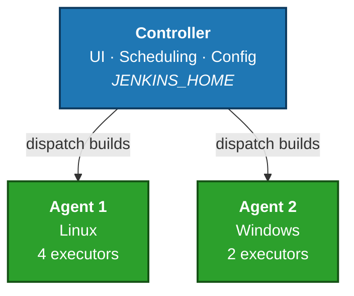

# Module 01 — Introduction & Fundamentals

## Learning Objectives
By the end of this module, you will be able to:
- Explain what Continuous Integration (CI) and Continuous Delivery (CD) mean.
- Describe what Jenkins is and where it fits in a software delivery workflow.
- Identify the major components of a Jenkins deployment.
- Decide when a standalone Jenkins server is the right choice.

## 1. What is CI/CD?

### Continuous Integration (CI)
CI is the practice of merging code changes into a shared branch frequently — ideally multiple times a day. Every merge automatically triggers a build and a suite of automated tests. The goal is to catch integration problems early, when they are still small and cheap to fix.

A typical CI flow:
1. Developer pushes a commit.
2. The CI server detects the change.
3. The server checks out the code, compiles it, runs unit tests, and produces a build artifact.
4. If anything fails, the team is notified immediately.

### Continuous Delivery (CD)
CD extends CI by automating the release process. Every successful build is automatically packaged, validated in test environments, and made ready to deploy to production with a single click.

### Continuous Deployment
A stricter form of CD where every change that passes the pipeline is deployed to production automatically — no human approval step.

### Why it matters
- **Faster feedback** — bugs are found in minutes, not weeks.
- **Lower risk** — small changes are easier to roll back than large ones.
- **Higher confidence** — automated tests run consistently every time.
- **Repeatability** — humans don't have to remember manual steps.

## 2. What is Jenkins?

Jenkins is an open-source automation server written in Java. It is one of the most widely deployed CI/CD tools in the world. Jenkins started in 2004 as a project called Hudson and was renamed in 2011.

At its core, Jenkins does one thing very well: **it runs jobs in response to triggers.** Those jobs can do almost anything — compile code, run tests, build container images, deploy applications, send notifications, or invoke other tools.

### Key strengths
- **Plugin ecosystem** — more than 1,800 plugins extend Jenkins to integrate with almost every tool in the software delivery stack.
- **Pipeline as Code** — pipelines are defined in a file (`Jenkinsfile`) checked into your source repository.
- **Distributed builds** — work can be spread across many agent machines.
- **Mature and stable** — used in production at thousands of organizations.

## 3. Jenkins Architecture

A Jenkins deployment has three main pieces:

### Controller (formerly "master")
The brain of Jenkins. The controller:
- Serves the web UI and the REST API.
- Stores all configuration in `JENKINS_HOME`.
- Schedules jobs.
- Dispatches work to agents.
- Collects build results and artifacts.

### Agents (formerly "slaves")
The hands of Jenkins. Agents are separate machines (or processes) that actually run the build work. Each agent has one or more **executors** — slots that can each run one build at a time.

You don't need agents — you can run everything on the controller — but for any non-trivial setup you will want to offload builds onto agents so the controller stays responsive.

### Executors
An executor is a single thread on a controller or agent that can run one build at a time. If an agent has 4 executors, it can run 4 builds in parallel.

### A simple diagram

## 4. When to choose a standalone server

A "standalone server" deployment means Jenkins runs as a long-lived process on a dedicated VM or physical server. This is the classic, simplest way to run Jenkins.

**Standalone is a good choice when:**
- You are running on-prem or in a single VM in the cloud.
- Your team is small to medium and your build volume is predictable.
- You don't have a Kubernetes cluster available (or don't want to operate one for CI).
- You want full control over the OS, file system, and installed tools.
- You need very specific kernel features, hardware (GPU), or system-level access on the build host.

**Standalone is a poor fit when:**
- Build demand is highly bursty and you need elastic scaling.
- You want fully ephemeral build environments per job.
- You already operate Kubernetes and want unified tooling.

We will cover both models — standalone in Part 1, and Kubernetes in Part 2.

## 5. Key Terminology — Cheat Sheet

| Term | Meaning |
|------|---------|
| Controller | The main Jenkins server. |
| Agent / Node | A machine that runs builds for the controller. |
| Executor | A single build slot on a controller or agent. |
| Job / Project | A configured unit of work in Jenkins. |
| Build | A single run of a job. |
| Pipeline | A job defined as code using a `Jenkinsfile`. |
| Workspace | The directory on an agent where a build's files live. |
| `JENKINS_HOME` | The directory on the controller that holds all Jenkins data. |
| Plugin | An installable extension that adds features. |

## 6. Hands-On Exercise

You don't need to install anything yet. Instead:

1. Visit `https://www.jenkins.io` and skim the landing page.
2. Open the Jenkins documentation and find the page describing the Controller-Agent architecture.
3. Write down, in your own words, the answers to:
   - What is the difference between a controller and an agent?
   - What is an executor?
   - What does `JENKINS_HOME` contain?

## 7. Knowledge Check
1. What does CI stand for, and what problem does it solve?
2. Name three things Jenkins can be used for.
3. Where does Jenkins store its configuration on a standalone server?
4. If an agent has 3 executors, how many builds can it run at the same time?
5. Give one situation where you would *not* choose a standalone Jenkins deployment.

## What's Next
In **Module 02** you will install Jenkins on a Linux server, secure it with HTTPS, and complete the initial setup wizard.
