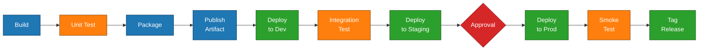

# Module 09 — Deployment & Release Workflows

## Learning Objectives
- Deploy to Linux/Windows servers from Jenkins.
- Deploy to AWS, Azure, and GCP services.
- Implement rolling and blue-green deployment strategies.
- Add approval gates and change management.
- Version and tag releases.
- Implement reliable rollbacks.

## 1. Deployment Patterns Overview

A deployment workflow usually looks like:



Each step is a stage in your pipeline (Module 10). Each environment has its own credentials, target hosts, and validation.

### Promotion vs rebuild
**Always deploy the same artifact you tested.** Rebuilding from source between environments introduces drift. Build once, store in an artifact repository, promote by reference (version number or SHA).

## 2. Deploying to Servers over SSH

The classic, durable pattern.

### Plugin
**Publish Over SSH** plugin — declares SSH targets globally and exposes them as build/pipeline steps.

### Configure SSH targets
**Manage Jenkins → System → Publish over SSH**:
- Add an SSH key (paste the private key or reference a credential).
- Define each server: host, user, remote root directory.

### Use in a pipeline
```groovy
stage('deploy') {
  steps {
    sshPublisher(publishers: [
      sshPublisherDesc(
        configName: 'web-server-prod',
        transfers: [
          sshTransfer(
            sourceFiles: 'dist/app-*.tar.gz',
            removePrefix: 'dist/',
            remoteDirectory: '/opt/app/releases',
            execCommand: 'cd /opt/app && ./deploy.sh'
          )
        ]
      )
    ])
  }
}
```

### Or just use `ssh` and `scp`
Sometimes the plugin is overkill. With an SSH credential bound:
```groovy
sshagent(['deploy-key']) {
  sh '''
    scp -o StrictHostKeyChecking=accept-new dist/app-${VERSION}.tar.gz deploy@web-01:/tmp/
    ssh deploy@web-01 "sudo /opt/app/install.sh /tmp/app-${VERSION}.tar.gz"
  '''
}
```

## 3. Deploying to AWS

### Authentication
- IAM user with access keys → store as `Username with password` or `AWS Credentials` plugin credential.
- Better: run the agent on an EC2 instance with an instance profile, or use IAM Roles Anywhere.
- Best: short-lived credentials via OIDC federation (if your AWS account supports it).

### Common AWS targets

**S3** (static sites, artifacts):
```groovy
withAWS(credentials: 'aws-deploy', region: 'us-east-1') {
  s3Upload(bucket: 'my-app-assets', includePathPattern: 'build/**')
}
```

**ECS** (containers):
```groovy
sh 'aws ecs update-service --cluster prod --service api --force-new-deployment'
```

**Elastic Beanstalk**:
```groovy
sh 'eb deploy production --version $BUILD_NUMBER'
```

**EC2 fleet via SSM**:
```groovy
sh '''
  aws ssm send-command \
    --document-name AWS-RunShellScript \
    --targets Key=tag:Role,Values=web \
    --parameters commands="['/opt/app/upgrade.sh ${VERSION}']"
'''
```

### Plugins
- **AWS Credentials**, **AWS Steps Plugin** (`withAWS`, `s3Upload`, `cfnUpdate`).
- **CodeDeploy** plugin if you use CodeDeploy.

## 4. Deploying to Azure

- **Azure Credentials** plugin — stores a service principal.
- `withCredentials` for client ID, tenant ID, secret; then `az login --service-principal ...`.
- App Service: `az webapp deploy --src-path app.zip --resource-group rg --name app`.
- AKS: covered in Part 2.

## 5. Deploying to GCP

- Service account JSON as a "Secret file" credential.
- `gcloud auth activate-service-account --key-file=$KEY`.
- App Engine: `gcloud app deploy`.
- Cloud Run: `gcloud run deploy SERVICE --image $IMAGE`.

## 6. Deployment Strategies

### Rolling
Update servers a few at a time so service stays up.
- Loop through servers in the pipeline.
- For each: drain from load balancer → upgrade → health-check → re-add.
- Stop on first failure.

```groovy
def servers = ['web-01', 'web-02', 'web-03']
servers.each { host ->
  sh "ssh deploy@${host} 'drain && upgrade ${VERSION} && health || exit 1'"
}
```

### Blue-Green
Maintain two environments. At any moment one is live (blue), one is idle (green).
1. Deploy new version to green.
2. Run smoke tests against green.
3. Flip the load balancer to point at green.
4. Keep blue around for quick rollback.

Implement the LB switch with whatever you have:
- DNS weight (CloudFront, Route53, Cloud DNS).
- LB target group swap.
- HAProxy/Nginx config reload.

### Canary
Send a small fraction of traffic (e.g., 5%) to the new version, watch error rates, then ramp up. Easier with a service mesh; on raw servers you can split via LB weights.

## 7. Approval Gates

Production deploys usually want a human in the loop.

### `input` step (covered in Module 11 in depth)
```groovy
stage('deploy prod') {
  steps {
    input message: "Promote ${VERSION} to production?",
          submitter: 'release-managers'
    sh './deploy-prod.sh'
  }
}
```

The pipeline pauses until someone in the `release-managers` group clicks Proceed (or Abort). The build holds an executor while waiting — for long pauses, see Module 11 on releasing the executor.

### Change tickets
- Add a step to create/close a ticket in your change management system (ServiceNow, Jira) via REST.
- Don't deploy without the ticket ID. Echo it into the build description for traceability.

## 8. Versioning and Tagging

Conventions that pay off:
- Tag every release in Git: `v1.4.7` or `2025.03.14-build42`.
- Embed the version into the artifact name: `myapp-1.4.7.jar`.
- Record `GIT_COMMIT` in build metadata.
- Use the same version end-to-end (build → artifact → image tag → deployed instance label).

In a pipeline:
```groovy
stage('tag') {
  steps {
    sshagent(['git-push-key']) {
      sh '''
        git tag -a v${VERSION} -m "Release ${VERSION} from build ${BUILD_NUMBER}"
        git push origin v${VERSION}
      '''
    }
  }
}
```

## 9. Rollback Strategies

You will need to roll back. Plan for it.

### Patterns
- **Redeploy previous artifact**: keep the last N versions in your repo; deploy `v1.4.6` to replace `v1.4.7`.
- **Blue-Green flip back**: just switch the LB.
- **Forward-fix**: prefer when the bug is small and a fix is faster than the rollback path.

### Make rollback its own job
A separate, parameterized job whose only purpose is "deploy a specific version":
```
Job: deploy-prod
Parameters: VERSION (string)
```
The release pipeline invokes this job with the new version. Rollback invokes the same job with the old version. The deploy path is the same in both cases — well-tested, single code path.

## 10. Smoke Tests After Deploy

Always validate after deploying.
- Hit a `/health` endpoint until it returns 200.
- Run a small synthetic transaction.
- Check error rate in your monitoring for 5 minutes; abort the pipeline (and trigger rollback) if it spikes.

```groovy
retry(10) {
  sleep 6
  sh 'curl -fsS https://prod.example.com/health'
}
```

## 11. Hands-On Exercise

1. Take the artifact from Module 06's exercise.
2. Provision two small VMs to act as "staging" and "production".
3. Pipeline:
   - Build and archive the artifact (already done).
   - Deploy to staging over SSH.
   - Smoke test staging.
   - `input` step asking for approval.
   - Deploy to production via the same code path.
   - Tag the Git commit on success.
4. Bonus: implement blue-green by running two production hosts behind an Nginx with `upstream` weights, and swap on each release.

## 12. Knowledge Check
1. Why "build once, promote many times" instead of rebuild per environment?
2. Name three plugins/steps for deploying to AWS.
3. How does blue-green deployment achieve zero-downtime rollback?
4. What information should you embed in a release tag?
5. Why turn rollback into a parameterized job rather than a separate code path?

## What's Next
You've finished Section B. Section C is **everything-as-code**. **Module 10** introduces Pipelines and the `Jenkinsfile`.
