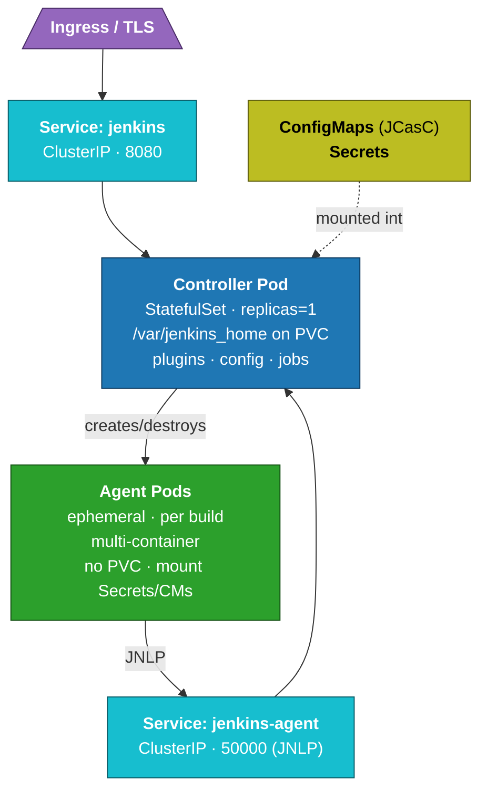

# Module 01 — Kubernetes Refresher (Jenkins-Relevant)

## Learning Objectives
- Recall the Kubernetes building blocks Jenkins relies on.
- Identify which resources are used by the Jenkins controller vs by agents.
- Understand how RBAC, networking, and storage map to Jenkins needs.
- Decide whether your cluster is ready to host Jenkins.

This module is a focused refresher — not a full Kubernetes course. If you've never touched Kubernetes, work through the official "Kubernetes Basics" tutorial first.

## 1. The Objects You'll Actually Use

### Pod
The smallest deployable unit — one or more containers running together. In Jenkins-on-K8s:
- The controller runs as a Pod (singleton).
- Each build runs in its own ephemeral Pod (the agent).

### Deployment / StatefulSet
- **Deployment** — manages replicas of stateless Pods. Used for stateless components.
- **StatefulSet** — gives Pods stable identities and stable storage. Jenkins controllers are typically deployed as a StatefulSet (or a Deployment with a single PVC) because they have persistent state.

### Service
A stable network endpoint pointing at a set of Pods.
- `ClusterIP` — internal only. Used for the JNLP port the agent connects to.
- `LoadBalancer` / `NodePort` — external. Rarely used directly for Jenkins; usually behind an Ingress.

### Ingress
HTTP(S) routing into the cluster. The Jenkins UI is exposed via an Ingress with TLS.

### ConfigMap
Plain-text config, mounted as files or env vars.
- Holds `jenkins.yaml` (JCasC) and other configs.

### Secret
Same as ConfigMap, base64-encoded, intended for credentials and tokens.
- Used for Jenkins admin password, Git SSH keys, registry credentials.
- *Not* encrypted at rest by default — enable etcd encryption or use Sealed Secrets / SOPS / External Secrets.

### PersistentVolume (PV) and PersistentVolumeClaim (PVC)
Disk storage that survives Pod restarts.
- The controller's `JENKINS_HOME` lives on a PVC backed by a PV.
- Agents typically *don't* have PVCs — workspaces are ephemeral per build.

### Namespace
A logical isolation unit. You typically put Jenkins in its own namespace, e.g. `jenkins`. Agent Pods may run in the same namespace or in dedicated namespaces.

## 2. ServiceAccounts & RBAC

Every Pod runs as a **ServiceAccount**. RBAC binds permissions to that account.

For Jenkins:
- The controller's ServiceAccount needs permission to manage Pods (to create agent Pods), and may need access to other namespaces, ConfigMaps, Secrets.
- Build/agent Pods should run with a *minimal* ServiceAccount — just enough to do their job (often nothing).

Key RBAC objects:
- **Role** / **ClusterRole** — a set of permissions.
- **RoleBinding** / **ClusterRoleBinding** — assigns a Role to a user, group, or ServiceAccount.

Example: the Jenkins controller needs at least:
- `pods`: get, list, create, delete, watch (in its agent namespace).
- `pods/exec`, `pods/log`: get.
- `secrets`: get, list, watch (for credentials sync, if used).

## 3. Storage

### StorageClass
Defines how PVs are provisioned (the backing disk type). On AWS this is typically EBS gp3; on GCP it's pd-balanced; on Azure it's Managed Disk Premium SSD.

For `JENKINS_HOME`:
- Choose a **ReadWriteOnce** (RWO) class — only the controller mounts it.
- Pick SSD-class storage; HDD will make Jenkins crawl.
- Size generously (start 50–100 GiB); resizing online is possible if the StorageClass supports it.

### Backup
EBS/PD snapshots, Velero, or restic. The PV/PVC names need to be stable for restore to work — which is why a StatefulSet (with `volumeClaimTemplates`) is convenient.

## 4. Networking

Two flows matter for Jenkins:

### UI / API ingress (HTTPS)
- Browser → Ingress → Service → controller Pod (port 8080).
- Use cert-manager + Let's Encrypt (or your enterprise PKI) for TLS.

### Controller ↔ Agent
- Agent Pod → controller Service (JNLP port 50000 or WebSocket on the HTTPS port).
- Prefer WebSocket mode: no separate port, traverses proxies cleanly.

### Network policies
By default, all Pods in a namespace can talk to each other. Lock this down:
- Agents only need to reach the controller (and the internet for `mvn`, `npm`, container registries).
- The controller only needs to accept ingress traffic and reach agents.

## 5. Workload Concepts

### Resource requests and limits
Every Pod declares CPU and memory requests/limits.
- **Request** — the scheduler reserves this much for the Pod.
- **Limit** — the kernel caps the Pod here; memory limit OOM-kills overruns.

For Jenkins:
- Controller request: 1–2 CPU, 2–4 GiB RAM minimum; tune up with usage.
- Controller limit: 2× request is a reasonable start.
- Agent: depends entirely on the build. Java compiles can easily need 4 GiB.

### Probes
- **livenessProbe** — restart the Pod if this fails.
- **readinessProbe** — exclude the Pod from the Service until it's ready.
- **startupProbe** — gives slow-starting apps a long grace period.

The Jenkins Helm chart configures sensible defaults; tune `initialDelaySeconds` if your install has many plugins (longer startup).

### Affinity, taints, tolerations
- Send build Pods to "build" nodes (cheaper, larger, possibly spot/preemptible) via node selectors and tolerations.
- Keep the controller on stable, on-demand nodes.

## 6. Cluster Components Jenkins Relies On

A Jenkins-on-K8s install presumes:
- A working **Ingress controller** (nginx-ingress, Traefik, or cloud-managed).
- A **CertManager** or other cert-issuing mechanism if you want TLS automation.
- A **CSI driver** for persistent storage.
- A **metrics server** for HPA (if you ever scale anything).
- A **container registry** Pods can pull from.
- (Optional) A **logging stack** (Loki/EFK) and **monitoring stack** (Prometheus/Grafana).

## 7. Is Your Cluster Ready?

Quick pre-flight:

```bash
kubectl get nodes                             # nodes Ready?
kubectl get storageclass                      # have a default SC?
kubectl get pods -A                           # ingress controller and DNS up?
kubectl create ns jenkins-preflight && kubectl delete ns jenkins-preflight   # can create namespaces?
kubectl auth can-i create deployments -n jenkins-preflight   # admin enough?
```

You should also confirm:
- DNS resolution works inside the cluster (`kubectl run -it --rm debug --image=busybox -- nslookup kubernetes`).
- Outbound internet works from a Pod (Jenkins must download plugins; agents pull images and dependencies).

## 8. Mental Model for Part 2

Think of Jenkins-on-K8s as three layers:



The controller is durable. Agents come and go. RBAC binds the controller's ServiceAccount so it can create agent Pods.

## 9. Hands-On Exercise

1. Spin up a small Kubernetes cluster: kind, minikube, k3d, or a managed cloud cluster.
2. Verify pre-flight checks above pass.
3. Create a namespace `jenkins`.
4. Create a ConfigMap from a one-line YAML file, then a Secret with a fake password. View both with `kubectl describe`.
5. Create a tiny Deployment + Service running `nginx` in the namespace; expose it through an Ingress; confirm you can reach it through your Ingress controller.

If all of that works, you're ready for Module 02.

## 10. Knowledge Check
1. Why use a StatefulSet (or PVC) for the Jenkins controller?
2. What does the controller's ServiceAccount need permission to do?
3. Why prefer WebSocket mode for agent connections?
4. What's the difference between a resource request and a resource limit?
5. List three cluster components Jenkins depends on.

## What's Next
**Module 02** maps out the Jenkins-on-Kubernetes architecture in detail before we install anything.
