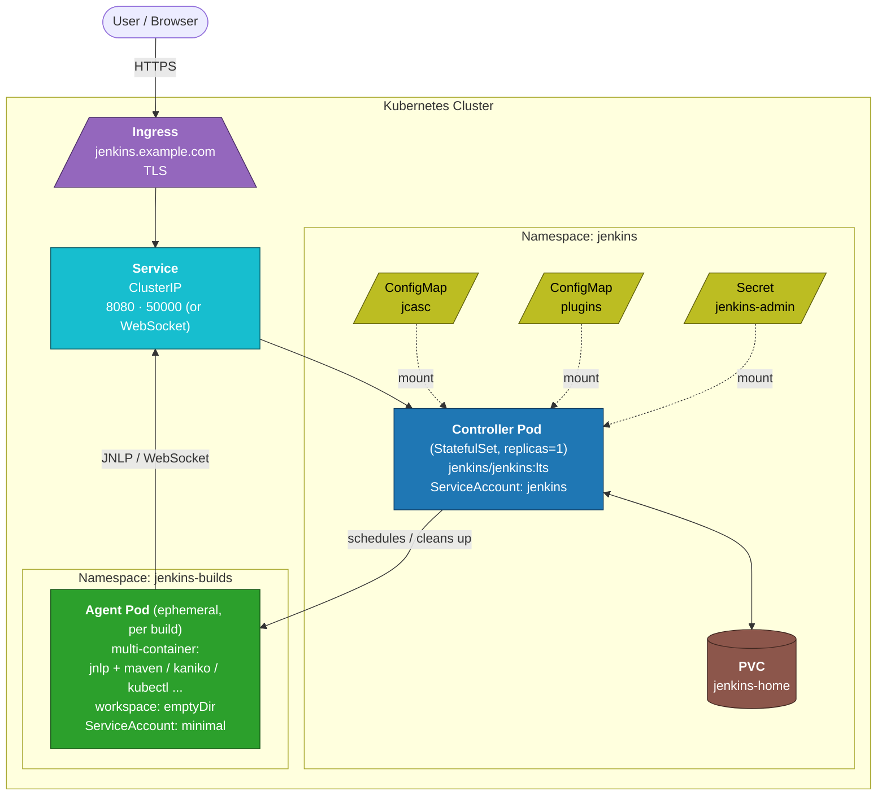

# Module 02 — Architecture on Kubernetes

## Learning Objectives
- Map every Jenkins component to a Kubernetes object.
- Decide between a single controller and multiple controllers.
- Plan ingress, networking, and storage.
- Understand multi-tenant patterns.

## 1. The Reference Architecture



Every other resource (RBAC, secrets, ConfigMaps, NetworkPolicies) wraps this picture.

## 2. Controller Layout

### Why StatefulSet vs Deployment
The controller is **inherently a singleton** with state. A Deployment can also work if you guarantee `replicas: 1` and bind a PVC. The Helm chart supports both. A StatefulSet:
- Gives the Pod a predictable name (`jenkins-0`) — handy for ops scripts.
- Manages the PVC lifecycle via `volumeClaimTemplates`.
- Strict update strategy (one at a time) matches the singleton constraint.

### `JENKINS_HOME` on a PVC
- Size: 50 GiB minimum; many setups want 200+ GiB. Easier to over-provision than to expand under pressure.
- Class: SSD with ReadWriteOnce.
- Backup: snapshot or Velero. Test restores.

### Probes
- Readiness: `GET /login` returning 200 (Jenkins is up).
- Liveness: same path but tolerant — many false positives if too strict.
- Startup probe with `failureThreshold` ≥ 30 covers slow plugin loads.

### Resource sizing
| Install | Requests | Limits |
|---------|----------|--------|
| Tiny (5 jobs/day) | 1 CPU, 2 GiB | 2 CPU, 4 GiB |
| Small (100 jobs/day) | 2 CPU, 4 GiB | 4 CPU, 8 GiB |
| Medium (1000 jobs/day) | 4 CPU, 8 GiB | 8 CPU, 16 GiB |
| Large | 8 CPU, 16 GiB | 16 CPU, 32 GiB |

Tune from metrics; these are rough starting points.

## 3. Agent Layout

Agents are ephemeral Pods created by the Kubernetes plugin in response to build demand.

A typical agent Pod is **multi-container**:
- `jnlp` — the Jenkins agent process itself.
- One or more **tool containers** — `maven`, `node`, `kaniko`, `kubectl`, etc.

All containers in the Pod share a volume (`/home/jenkins/agent`), so a step running in the `maven` container leaves files visible to a step running in the `kaniko` container.

The Pod is deleted at the end of the build by default.

We cover pod templates in depth in Module 04.

## 4. Networking

### Ingress
- One Ingress object, typically `jenkins.example.com`.
- TLS terminated by the Ingress controller (cert-manager + Let's Encrypt or your CA).
- Annotations vary by Ingress controller: timeout settings, body size, sticky sessions (Jenkins UI uses sessions but doesn't strictly require sticky if there's only one Pod).

### Controller Service
- `ClusterIP` Service exposing 8080 (UI/API).
- Optionally exposes 50000 for legacy JNLP. Prefer WebSocket — same port as the UI.

### Agent connectivity
- WebSocket mode (recommended): agent connects to the Service on the HTTPS/HTTP port; goes through the Ingress only if outside the cluster, otherwise straight via ClusterIP.
- Legacy JNLP: agent connects to port 50000 on the controller Service.

### Egress
- Controller needs outbound: update center, plugin downloads.
- Agents need outbound: Git providers, package registries, container registries, your deployment targets.

### Network policies
Default: lock all ingress except from the Ingress controller; allow agent-to-controller on 8080/50000. Allow egress as needed (DNS, HTTPS).

## 5. Storage Decisions

### Controller PVC
- ReadWriteOnce SSD.
- Backup strategy decided upfront — change later is hard.
- Periodic resize alerts.

### Agent caches (optional)
Repeated builds love caches: Maven local repo, npm cache, Docker layer cache.
- Quick win: a PVC mounted into agent Pods, possibly ReadWriteMany on a shared filesystem (EFS, Filestore, Azure Files).
- Pitfall: shared caches can corrupt or get locked. Many teams prefer per-agent ephemeral caches plus remote cache services (S3-backed Bazel/Nx/Gradle caches).

### Build artifacts
- Don't keep big artifacts on the controller PVC.
- Push to an artifact repository or object storage; controller only stores references.

## 6. Identity

### ServiceAccount for the controller
Create a `jenkins` ServiceAccount in the namespace. Bind a Role with at minimum:
```yaml
rules:
- apiGroups: [""]
  resources: ["pods", "pods/exec", "pods/log"]
  verbs: ["get","list","watch","create","update","patch","delete"]
- apiGroups: [""]
  resources: ["secrets"]
  verbs: ["get","list","watch"]
```

If agents live in **other** namespaces, you need a ClusterRoleBinding or per-namespace bindings.

### ServiceAccount for agents
Default — only what the build needs. If your build runs `kubectl apply` to deploy to the cluster, agents need a separate, scoped ServiceAccount.

### External identity
- For external secret stores (Vault), use Kubernetes-native auth methods.
- For cloud APIs (AWS/GCP/Azure), use workload identity / IRSA — short-lived credentials, no static secrets.

## 7. Single vs Multiple Controllers

### Single controller
Simplest. One Helm release, one PVC, one URL. Works for many organizations indefinitely.

### Multiple controllers
Useful when:
- Multiple business units want independent admin authority.
- Teams need plugin isolation (one team needs a plugin another team can't tolerate).
- Compliance requires segregation.

Patterns:
- **One Jenkins per team**, all in the same cluster, distinct namespaces and Ingress hostnames.
- **Operations controller** plus **per-team execution controllers** — the ops controller manages shared infra, agents, libraries.
- **CloudBees CI** offers a managed-controllers product on top of this pattern; out of scope here.

Trade-off: every extra controller is more upgrade work, more URLs, more identity to manage.

## 8. High Availability — Honest Talk

Open-source Jenkins is **active-passive** at best. You can:
- Run one controller and rely on fast restart from PVC for "HA".
- Add a hot standby — periodically rsync the PVC to a second cluster, fail over manually.
- Reduce blast radius by sharding into multiple controllers.

The Kubernetes scheduler will reschedule a failed Pod onto a healthy node, which is the bulk of the value most teams need.

## 9. Multi-Tenant Patterns

Even with one controller, you often serve many teams. Use:
- **Folders** + Role-Based Authorization + Folder-scoped credentials to isolate teams.
- **Pod templates per team** if their build environment differs.
- **NetworkPolicies per agent namespace** so team A's builds can't reach team B's services.
- **ResourceQuota** on agent namespaces so a runaway team can't starve others.

## 10. Decisions to Make Before Module 03

Before installing, write down:
- Namespace name (`jenkins`).
- Hostname (`jenkins.example.com`) and cert source.
- StorageClass for the controller PVC and the size.
- Whether agents live in the controller namespace or a separate `jenkins-builds` namespace.
- Initial plugin list.
- Authentication source (local for now; SSO later).
- Backup mechanism.

## 11. Hands-On Exercise

Sketch your target architecture diagram for your own cluster. Include:
- Namespaces.
- Ingress hostname and cert source.
- PVC size and StorageClass.
- ServiceAccount and roles.
- Agent namespace, if separate.

You'll use this in Module 03 when you actually deploy.

## 12. Knowledge Check
1. Why StatefulSet (or single-replica Deployment with PVC) and not a multi-replica Deployment?
2. What's in a multi-container agent Pod and why?
3. How do agents talk to the controller in WebSocket mode?
4. When would you run more than one Jenkins controller?
5. What does the controller's ServiceAccount need permission to do?

## What's Next
**Module 03** installs Jenkins on your cluster via the official Helm chart.
