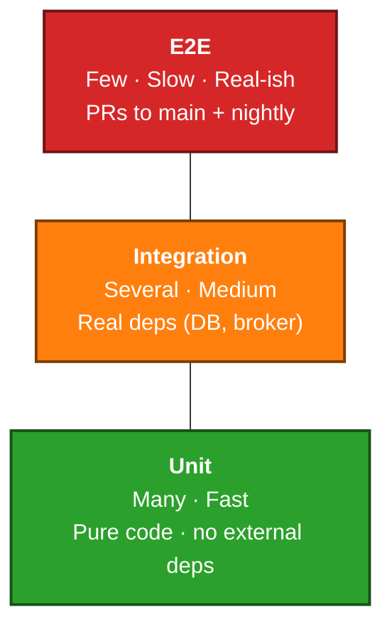

# Module 09 — Testing & Quality Gates in K8s Pipelines

## Learning Objectives
- Run unit, integration, and end-to-end tests inside Kubernetes agents.
- Spin up ephemeral namespaces per pull request.
- Wire in SAST, dependency, container, and policy scans.
- Publish results back to Jenkins and to pull requests.

## 1. The Test Pyramid in a K8s Pipeline



Map each layer to a stage; run unit tests on every commit, integration tests on PR + merge, end-to-end on merge to `main`.

## 2. Unit Tests

Same as Part 1 — run inside the relevant tool container:
```groovy
container('maven') { sh 'mvn -B test' }
container('node')  { sh 'npm test' }
container('python'){ sh 'pytest -q' }
```

Publish JUnit-style XML:
```groovy
post { always { junit '**/*-test-results/*.xml' } }
```

Code coverage (JaCoCo, lcov, coverage.py) via the **Coverage** plugin:
```groovy
post {
  always {
    recordCoverage tools: [[parser: 'JACOCO', pattern: '**/jacoco.xml']]
  }
}
```

## 3. Integration Tests with In-Pod Dependencies

When the test needs a database or broker, run it as a sidecar container in the same Pod:

```yaml
containers:
  - name: jnlp
    image: jenkins/inbound-agent:latest
  - name: app
    image: maven:3.9-eclipse-temurin-17
    command: ['sleep']; args: ['9999999']
  - name: postgres
    image: postgres:16
    env:
      - { name: POSTGRES_PASSWORD, value: pass }
      - { name: POSTGRES_DB, value: app }
  - name: redis
    image: redis:7
```

The tests reach `postgres` at `localhost:5432` and `redis` at `localhost:6379` because all containers in a Pod share the network namespace.

```groovy
stage('integration') {
  steps {
    container('app') { sh 'mvn -B verify -Pintegration' }
  }
  post { always { junit '**/it-results/*.xml' } }
}
```

When sidecars don't fit (need persistence, more replicas, multi-tier setups), use ephemeral namespaces instead.

## 4. Ephemeral Namespaces per PR

The pattern: for every PR, create a namespace `payments-pr-${PR_NUMBER}`, deploy the app + its dependencies there, run tests, tear down.

```groovy
pipeline {
  agent { kubernetes { yamlFile 'ci/agent-pod.yaml' } }

  environment { NS = "payments-pr-${env.CHANGE_ID}" }

  stages {
    stage('namespace') {
      when { changeRequest() }
      steps {
        container('kubectl') {
          sh 'kubectl create namespace ${NS} || true'
          sh 'kubectl label namespace ${NS} purpose=pr ttl=24h --overwrite'
        }
      }
    }

    stage('deploy preview') {
      when { changeRequest() }
      steps {
        container('helm') {
          sh '''
            helm upgrade payments-api ./chart \
              --install --namespace ${NS} \
              --set image.tag=${BUILD_NUMBER} \
              --values ./chart/values-pr.yaml \
              --atomic --timeout 5m
          '''
        }
      }
    }

    stage('e2e') {
      when { changeRequest() }
      steps {
        sh './run-e2e.sh https://${NS}.preview.example.com'
      }
    }
  }

  post {
    always {
      script {
        if (env.CHANGE_ID) {
          container('kubectl') { sh "kubectl delete namespace ${NS} --ignore-not-found" }
        }
      }
    }
  }
}
```

### Background garbage collection
PRs sometimes leave debris (e.g., a build crashed before teardown). Run a daily cleanup job:
```bash
kubectl get ns -l purpose=pr -o json | jq -r '.items[] |
  select(.metadata.creationTimestamp < (now - 86400 | strftime("%Y-%m-%dT%H:%M:%SZ"))) |
  .metadata.name' | xargs -r kubectl delete ns
```

### Preview URLs
Create an Ingress per PR pointing at `payments-api.${NS}.svc.cluster.local`. Tie the hostname to the PR number — `pr-42.preview.example.com`. Wildcard DNS makes this trivial.

Post the preview URL back to the pull request from Jenkins (GitHub API, GitLab Notes API) so reviewers can click and check.

## 5. End-to-End Tests in a K8s World

Tools commonly used: Cypress, Playwright, Selenium grid, k6 (load).

Selenium grid as sidecars:
```yaml
- name: selenium
  image: selenium/standalone-chrome:latest
  resources: { requests: { memory: "2Gi" } }
```

Cypress in a dedicated container:
```yaml
- name: cypress
  image: cypress/included:13
  command: ['sleep']; args: ['9999999']
```

```groovy
container('cypress') {
  sh "cypress run --browser chrome --config baseUrl=https://${NS}.preview.example.com"
}
```

Archive videos/screenshots on failure for diagnosis:
```groovy
post {
  failure {
    archiveArtifacts artifacts: '**/cypress/videos/**, **/cypress/screenshots/**'
  }
}
```

## 6. Static Analysis (SAST)

Run linters and static analyzers as parallel stages:

```groovy
stage('checks') {
  parallel {
    stage('lint')     { steps { container('node')   { sh 'npx eslint .' } } }
    stage('type')     { steps { container('node')   { sh 'npx tsc --noEmit' } } }
    stage('java')     { steps { container('maven')  { sh 'mvn checkstyle:check spotbugs:check' } } }
    stage('python')   { steps { container('python') { sh 'ruff check . && mypy .' } } }
  }
}
```

Aggregate findings with the **Warnings Next Generation** plugin (covered in Part 1 Module 06):
```groovy
recordIssues tools: [
  esLint(pattern: '**/eslint.json'),
  checkStyle(pattern: '**/checkstyle-result.xml'),
  spotBugs(pattern: '**/spotbugsXml.xml')
]
```

## 7. Dependency Scanning (SCA)

### Trivy for filesystem deps
```groovy
container('trivy') {
  sh '''
    trivy fs . \
      --scanners vuln,misconfig,secret \
      --severity HIGH,CRITICAL \
      --exit-code 1 \
      --format json --output trivy-fs.json
  '''
  archiveArtifacts 'trivy-fs.json'
}
```

### OWASP Dependency-Check (Java/.NET)
```groovy
container('owasp') {
  sh 'dependency-check.sh --project app --scan . --failOnCVSS 7'
}
```

### Snyk / Grype
Equivalent. Pick one and stick with it; combining several creates noise.

## 8. Container Scanning

Cover both the image you ship and its base image. Module 07 showed Trivy after build; repeat the discipline in your shared pipeline template.

Block the build on HIGH/CRITICAL by default. Allow targeted exceptions via an allowlist file checked into the repo (`.trivyignore`) so suppressions go through code review.

## 9. Policy Checks (OPA / Conftest)

If you ship Kubernetes manifests as part of your release, validate them:
```groovy
container('conftest') {
  sh 'conftest verify --policy policy/ chart/templates/'
}
```

Common policies:
- Containers must set CPU/memory limits.
- Images must come from your registry.
- No `latest` tags.
- No privileged containers in app workloads.

Run on every PR; a failed policy fails the build.

## 10. Quality Gate (SonarQube)

Wire SonarQube as in Part 1 Module 06. On Kubernetes, the only difference is that the SonarQube server is likely also in-cluster — point Jenkins at its Service.

```groovy
stage('sonar') {
  steps {
    withSonarQubeEnv('sonar') {
      container('maven') { sh 'mvn -B sonar:sonar' }
    }
  }
}
stage('gate') {
  steps { timeout(time: 5, unit: 'MINUTES') { waitForQualityGate abortPipeline: true } }
}
```

## 11. Surfacing Results

- **JUnit / Coverage / Warnings** — visible on the build page and on the multibranch project's trends.
- **GitHub Checks API** — the GitHub Branch Source plugin posts pipeline stage results back to the PR. Each stage becomes a check.
- **Slack** — for visibility, post quality gate failures with a link.
- **Build description** — set `currentBuild.description` with the PR number, preview URL, and key counts (tests, vulns).

## 12. A Combined Verify Stage

```groovy
stage('verify') {
  parallel {
    stage('unit')       { steps { container('maven')  { sh 'mvn -B test' } } }
    stage('integration'){ steps { container('maven')  { sh 'mvn -B verify -Pintegration' } } }
    stage('lint')       { steps { container('maven')  { sh 'mvn -B checkstyle:check spotbugs:check' } } }
    stage('deps')       { steps { container('trivy')  { sh 'trivy fs --severity HIGH,CRITICAL --exit-code 1 .' } } }
    stage('policy')     { steps { container('conftest'){ sh 'conftest verify --policy policy/ chart/templates/' } } }
  }
  post {
    always {
      junit '**/*-results/*.xml'
      recordCoverage tools: [[parser: 'JACOCO', pattern: '**/jacoco.xml']]
      recordIssues tools: [checkStyle(pattern: '**/checkstyle-result.xml'),
                           spotBugs(pattern: '**/spotbugsXml.xml')]
    }
  }
}
```

## 13. Hands-On Exercise

1. Add ephemeral namespace support to your sample pipeline. Each PR creates `app-pr-<num>`, deploys the chart, runs a smoke test, and tears it down.
2. Wildcard DNS or in-cluster preview URLs — pick one and wire it.
3. Add at least three parallel checks in `verify`: unit, lint, container scan.
4. Add an OPA/Conftest policy that fails the build if any Pod manifest is missing CPU limits.
5. Confirm a deliberately misconfigured manifest fails the check.

## 14. Knowledge Check
1. When are sidecar containers the right place for dependencies, and when isn't it?
2. What ensures PR namespaces don't accumulate forever?
3. What does the GitHub Branch Source plugin add to a pull request?
4. Name three categories of "quality gates" you'd put on every pipeline.
5. Why post the preview URL back to the PR rather than just to Slack?

## What's Next
**Module 10** is about scaling and performance — making the agent fleet elastic and cost-effective.
